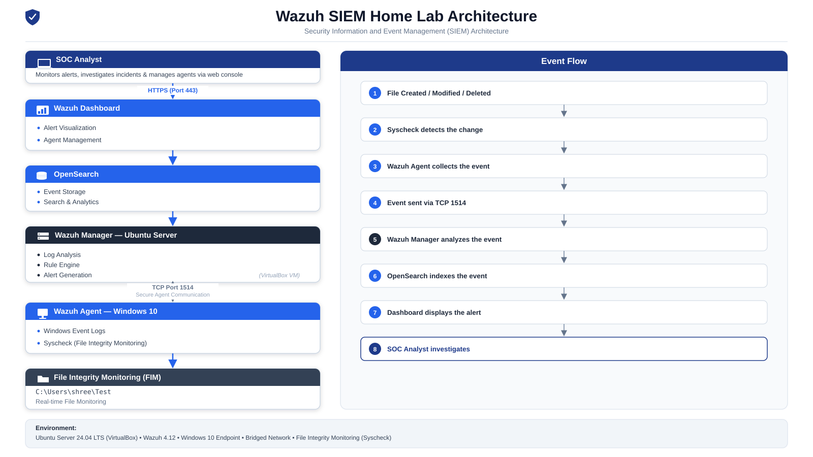
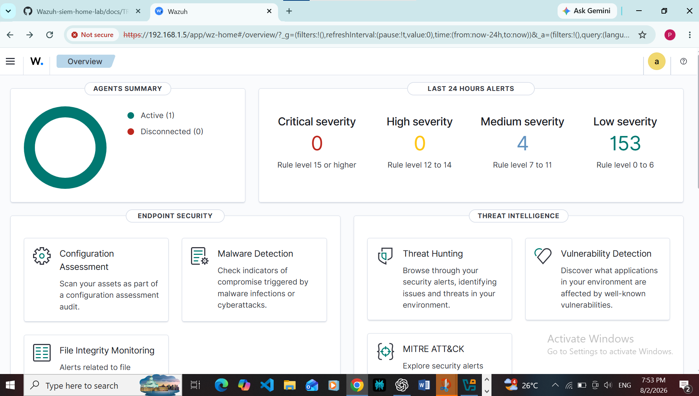
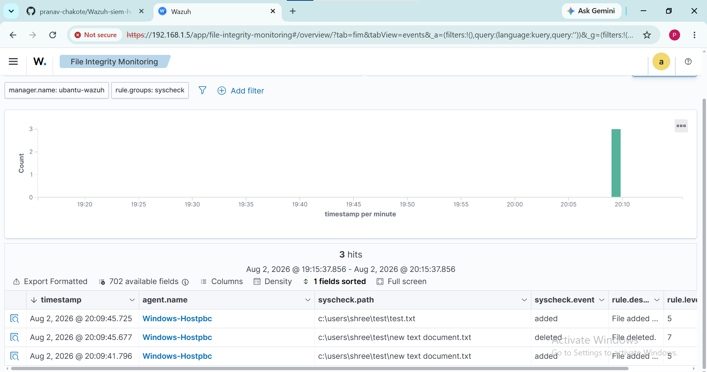

# 🛡️ Wazuh SIEM Home Lab with File Integrity Monitoring (FIM)
## 📐 Architecture Diagram

## 📌 Project Overview

This project demonstrates the deployment of a Wazuh SIEM environment using an Ubuntu Server as the Wazuh Manager and a Windows 10 endpoint as the Wazuh Agent.

The lab demonstrates centralized log collection, endpoint monitoring, and File Integrity Monitoring (FIM). Wazuh detects file creation, modification, and deletion events in real time and displays them on the Wazuh Dashboard for security monitoring.

---
## 🛠️ Tech Stack

- **SIEM Platform:** Wazuh 4.12
- **Operating System:** Ubuntu Server 24.04 LTS
- **Endpoint:** Windows 10
- **Search Engine:** OpenSearch
- **Dashboard:** Wazuh Dashboard
- **Virtualization:** Oracle VirtualBox
- **Monitoring Module:** Syscheck (File Integrity Monitoring)
- **Log Source:** Windows Event Logs
- **Communication Protocol:** TCP (Port 1514)
## ⚙️ Setup

The complete installation guide is available here:

📄 **[SETUP.md](docs/SETUP.md)**

### Quick Setup

1. Install Ubuntu Server.
2. Install the Wazuh Manager.
3. Access the Wazuh Dashboard.
4. Install the Windows Agent.
5. Register the Agent.
6. Configure File Integrity Monitoring.
7. Verify alerts.
## 📊 Dashboard

## 🚨 Detection Use Cases

### 1. File Creation Detection

**Objective:** Detect the creation of a new file in the monitored directory.

**Process:**
- Created a new file inside `C:\Users\shree\Test`.
- Syscheck detected the file creation.
- The Wazuh Agent forwarded the event to the Wazuh Manager.
- The Wazuh Dashboard generated a File Integrity Monitoring (FIM) alert.

**Outcome:** Successfully detected and recorded file creation in real time.

📷 **Screenshot:** 

---

### 2. File Modification Detection

**Objective:** Detect unauthorized modifications to an existing monitored file.

**Process:**
- Modified an existing file in the monitored directory.
- Syscheck detected the integrity change.
- The event was analyzed by the Wazuh Manager.
- A File Integrity Monitoring alert was displayed in the Wazuh Dashboard.

**Outcome:** Successfully detected and reported file modification.

📷 **Screenshot:** `images/file-modified.png`

---

### 3. File Deletion Detection

**Objective:** Detect deletion of monitored files.

**Process:**
- Deleted a monitored file.
- The Wazuh Agent captured the deletion event.
- The Wazuh Manager processed the event and generated an alert.
- The alert was displayed in the dashboard.

**Outcome:** Successfully detected file deletion in real time.

📷 **Screenshot:** `images/file-deleted.png`
## 📚 Key Findings / What I Learned

This project provided practical experience in deploying and managing a Security Information and Event Management (SIEM) solution using Wazuh.

### Key Learnings

- Deployed and configured a Wazuh SIEM environment from scratch.
- Installed and registered a Windows endpoint with the Wazuh Manager.
- Configured File Integrity Monitoring (FIM) using the Syscheck module.
- Understood the complete event flow from endpoint detection to dashboard visualization.
- Learned how security events are analyzed and correlated by the Wazuh Manager.
- Gained experience investigating File Integrity Monitoring alerts through the Wazuh Dashboard.
- Improved troubleshooting skills by resolving agent connectivity, networking, and configuration issues.

  ## 🚀 Future Improvements

This home lab can be extended further by implementing additional enterprise security capabilities.

- Add multiple Windows and Linux endpoints.
- Integrate Microsoft Sysmon for enhanced Windows telemetry.
- Configure Active Response to automatically block malicious activity.
- Create custom Wazuh detection rules for advanced threat detection.
- Integrate email or Slack notifications for critical security alerts.
- Simulate attacks using Atomic Red Team and map detections to the MITRE ATT&CK framework.
- Deploy the lab in a cloud environment for scalability and remote monitoring.

  ## 📸 Screenshots

The screenshots below demonstrate the deployment and validation of the Wazuh SIEM Home Lab.

| Screenshot | Description |
|------------|-------------|
| `images/architecture.svg` | Overall SIEM architecture |
| `images/dashboard.png` | Wazuh Dashboard overview |
| `images/agent-active.png` | Successfully registered Windows Agent |
| `images/file-created.png` | File creation detection alert |
| `images/file-modified.png` | File modification detection alert |
| `images/file-deleted.png` | File deletion detection alert |

## 💡 Skills Demonstrated

- SIEM Deployment (Wazuh)
- Security Monitoring
- File Integrity Monitoring (FIM)
- Windows Event Log Analysis
- Endpoint Monitoring
- Ubuntu Server Administration
- VirtualBox Networking
- Security Alert Investigation
- Incident Detection and Analysis

